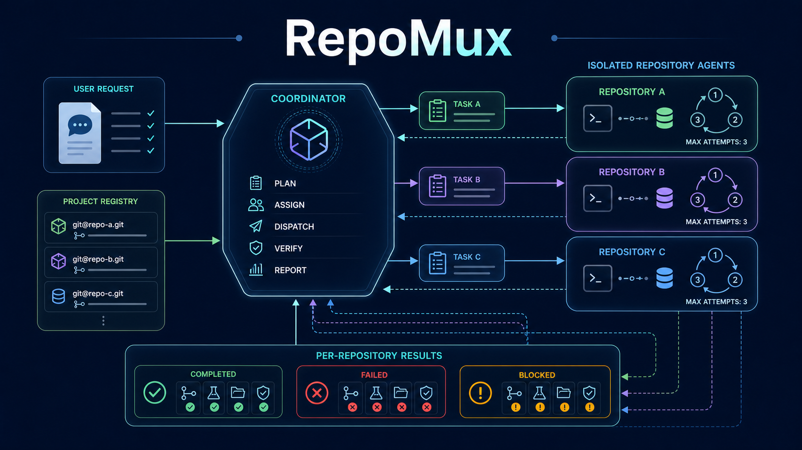
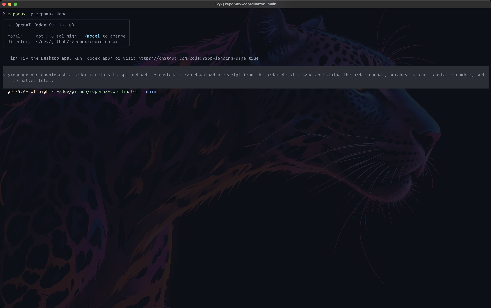
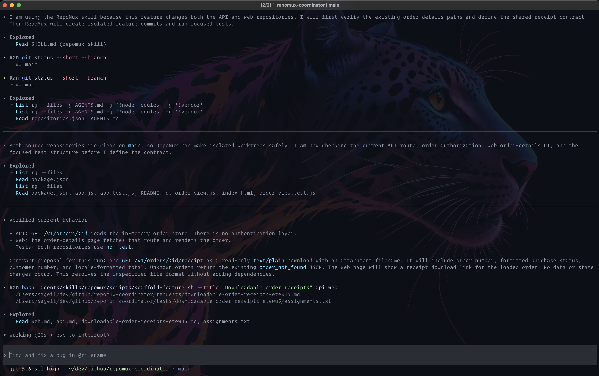
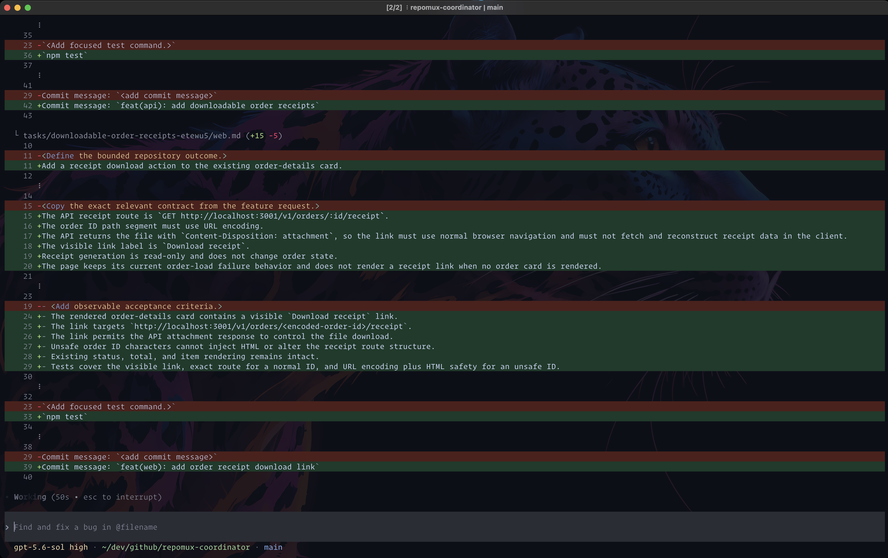
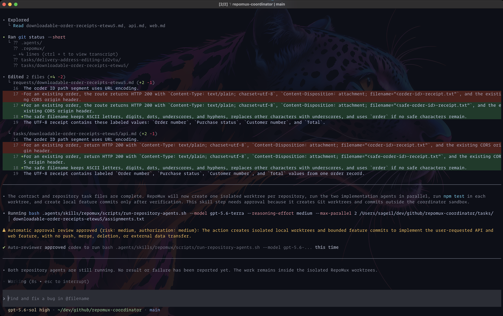
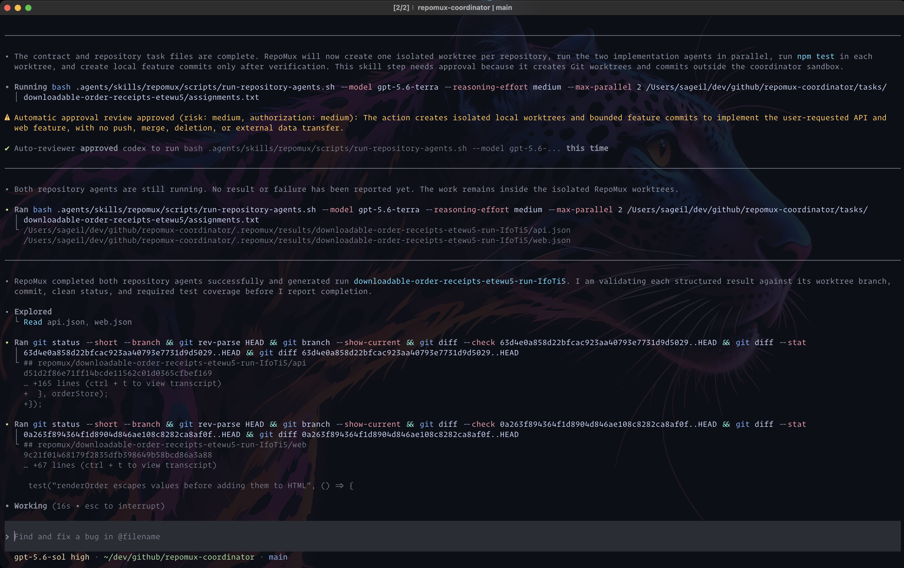
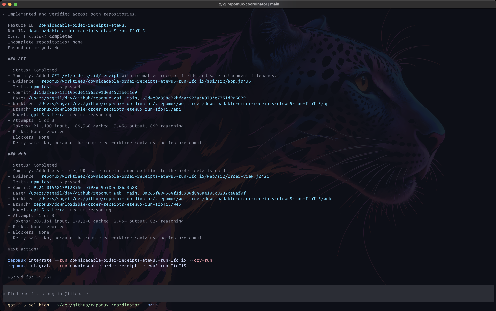
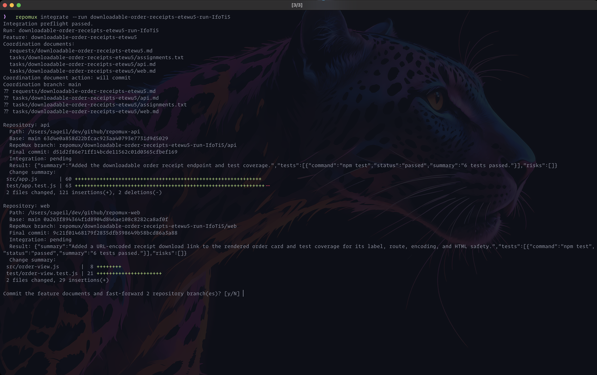
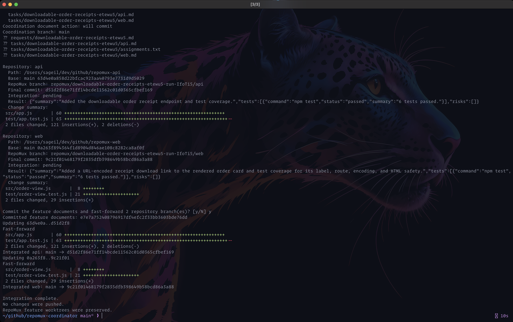

# RepoMux

RepoMux provides deterministic workflow controls around coordinated multi-repository coding agents.

You describe one feature to a coordinator and the coordinator writes the shared requirements, assigns the work, and starts one isolated repository agent for each affected repository.
RepoMux controls the worktree layout, validation, retries, commits, and completion report.



```text
feature request
    -> shared requirements and repository tasks
    -> isolated repository branches and worktrees
    -> validated local commits
    -> user review and integration
```

RepoMux does not merge or push product repository changes during implementation.
The `repomux integrate` command performs local fast-forwards only after you run it and confirm the operation.
RepoMux never pushes changes.

## Before you start

You need:

- Bash 3.2 or later.
- Git.
- `jq`.
- Codex CLI 0.147.0 or later.

Each product repository must be a Git repository with at least one commit.

## Quick start

This example uses two product repositories, `acme-orders-api` and `acme-storefront`.
It uses `acme-commerce-coordinate` for RepoMux configuration, requirements, repository tasks, results, and worktrees.

### 1. Install RepoMux

Clone this repository, then run:

```bash
./install.sh
```

The default installation creates:

```text
~/.local/bin/repomux
~/.local/share/repomux/skill/
```

If `~/.local/bin` is not in `PATH`, it prints the command you must add.

You can also use a different command directory if needed:

```bash
./install.sh --bin-dir /absolute/command/directory
```

The cloned RepoMux repository is not required for normal use.
Keep it when you want to inspect or update the installed files.

### 2. Initialize the project

From an existing coordination repository:

```bash
cd /work/acme-commerce-coordinate

repomux init \
  -p acme-commerce \
  -c "$PWD" \
  -r "orders-api=$PWD/../acme-orders-api" \
  -r "storefront=$PWD/../acme-storefront"
```

The short options are:

- `-p` for `--project`.
- `-c` for `--coordinate`.
- `-r` for `--repository`.

The shell expands `$PWD` or `$(pwd)` before RepoMux receives the arguments.
Quote an argument when its path can contain spaces.

If the coordination repository does not exist, let RepoMux create it:

```bash
repomux init \
  -p acme-commerce \
  -c /work/acme-commerce-coordinate \
  --create-coordinate \
  -r orders-api=/work/acme-orders-api \
  -r storefront=/work/acme-storefront
```

`--create-coordinate` accepts an absent directory or an existing empty directory.
RepoMux refuses to initialize a nonempty directory that is not already a Git repository.

Initialization creates:

```text
acme-commerce-coordinate/
├── .agents/skills/repomux/
├── .repomux/
│   ├── repositories.json
│   ├── results/.gitignore
│   └── worktrees/.gitignore
├── requests/
└── tasks/
```

RepoMux also registers the project in `~/.config/repomux/projects.json`.

### 3. Start the coordinator

Run RepoMux from the coordination repository or either registered product repository:

```bash
repomux
```

RepoMux selects the project from the current directory and starts Codex with the `workspace-write` sandbox using your configured Codex permissions.

You can also select the project by name from any directory:

```bash
repomux --project acme-commerce
```

### 4. Request a new feature

Describe the behavior you want inside the Codex session.
Use the repository keys from the initialization command, such as `orders-api` and `storefront`:

```text
$repomux Add customer order cancellation to orders-api and storefront so customers can cancel an eligible order from the order-details page and see the updated status without reloading.
```

You do not need a requirements file or feature ID.
RepoMux creates one from the feature title, such as `customer-order-cancellation-a31f7c`.
It also creates a unique run ID, such as `customer-order-cancellation-a31f7c-run-k82mqp`.
The six-character suffixes will differ for each generated ID.

## Workflow Screen Captures

These captures show one complete feature workflow in timestamp order.

### 1. Submit the feature request

Start RepoMux for the registered project and describe the cross-repository feature to the coordinator.



### 2. Inspect the repositories and define the contract

The coordinator verifies both repositories, inspects the existing API and web paths, and defines the shared receipt contract.



### 3. Prepare the repository tasks

The coordinator writes bounded API and web tasks with acceptance criteria, test commands, and commit messages.



### 4. Approve isolated implementation

RepoMux requests elevated execution for the runner because it must create local Git worktrees and feature commits outside the coordinator sandbox.
The repository agents then run in parallel inside their isolated worktrees.



### 5. Validate the repository results

After both repository agents finish, the coordinator checks their structured results, worktree branches, commits, clean state, and required tests.



### 6. Review the completion report

The completion report shows each repository status, test result, commit, worktree, branch, attempt count, and token usage.
It also provides the dry-run and integration commands.



### 7. Review the integration preflight

The integration command verifies the feature documents and repository commits, then shows the planned local fast-forwards before it asks for confirmation.



### 8. Confirm local integration

After confirmation, RepoMux commits the feature documents and fast-forwards the product repository branches.
It preserves the feature worktrees and does not push changes.



## What RepoMux creates for a feature

The coordinator writes the feature documents into its current checkout:

```text
requests/customer-order-cancellation-a31f7c.md
tasks/customer-order-cancellation-a31f7c/orders-api.md
tasks/customer-order-cancellation-a31f7c/storefront.md
tasks/customer-order-cancellation-a31f7c/assignments.txt
```

The request file contains the shared requirements and cross-repository contract.
Each repository task contains the repository goal, relevant contract, acceptance criteria, commit message, and focused test commands.
The assignments file connects each repository key and path to its task file.

For each product repository, `RepoMux` records the current branch and commit, then creates:

```text
Branch:   repomux/<run-id>/<repository-key>
Worktree: <coordination-repository>/.repomux/worktrees/<run-id>/<repository-key>
Result:   <coordination-repository>/.repomux/results/<run-id>/<repository-key>.json
```

Every attempt for that repository uses the same worktree.
The repository agent can edit the worktree but cannot write linked Git metadata.
Network access follows the active Codex configuration and profile.
RepoMux creates the local commit after the repository agent reports completion and the completion checks pass.
A completed result requires a new matching commit, a clean worktree, at least one created test, all reported tests passed, and no blockers.
Your original product repository checkout remains unchanged until you run the integration command or merge the RepoMux branch yourself.

## Understand token usage

RepoMux limits growth of the coordinator context by running each repository assignment in a separate ephemeral `codex exec` session.
Each repository agent receives its own task and repository context instead of the coordinator conversation or another repository's implementation details.
After the repository agents finish, the coordinator reads their structured result files instead of their command logs, source files, diffs, or intermediate output.

This separation does not guarantee lower total token use.
The coordinator and every repository-agent attempt use tokens independently, and retries add more usage.
Parallel repository agents reduce elapsed time, not token use.

Each repository result records cumulative usage for all attempts under `execution.usage`.
Read the usage for one repository with:

```bash
jq '.execution.usage' \
  /work/acme-commerce-coordinate/.repomux/results/customer-order-cancellation-a31f7c-run-k82mqp/orders-api.json
```

The result contains `input_tokens`, `cached_input_tokens`, `output_tokens`, and `reasoning_output_tokens`.
The value is `null` when no repository-agent attempt completed far enough to report usage.

## Review and integrate a completed feature

The coordinator reports the run ID when every affected repository is complete.
The integration command requires the run manifest created by the current repository runner.
Runs created before this manifest was added remain available for manual integration.

Start with a dry run:

```bash
repomux integrate \
  --project acme-commerce \
  --run customer-order-cancellation-a31f7c-run-k82mqp \
  --dry-run
```

The dry run validates every result, test, commit, base branch, and preserved worktree.
It shows the feature documents, repository summaries, tests, branches, commits, and diff statistics.
It exits with a nonzero status when the run cannot be integrated.
It does not prompt or change files, commits, branches, worktrees, or RepoMux state.

When the dry run passes, run the same command without `--dry-run`:

```bash
repomux integrate \
  --project acme-commerce \
  --run customer-order-cancellation-a31f7c-run-k82mqp
```

RepoMux repeats the preflight and shows the same plan.
It then asks once for permission.

After you confirm, RepoMux:

1. Commits only the recorded request, repository tasks, and assignments file in the coordination repository.
2. Fast-forwards each recorded product base branch to its completed RepoMux commit.
3. Verifies every updated branch.
4. Preserves the RepoMux feature branches and worktrees.

RepoMux does not switch a product checkout that is on another branch.
It stops before integration when a result is incomplete, a recorded feature document changed, a pending target branch checkout is dirty, or a base branch diverged.
If integration stops after one repository was updated, correct the reported problem and run the same command again.
The repeated command skips documents and repositories that are already integrated.
The command never pushes changes.

## Use an existing requirements file

Start the coordinator, then name the existing feature ID and file in your prompt:

```text
$repomux Implement COMMERCE-2197 in the orders-api and storefront repositories using the requirements in incoming/COMMERCE-2197.md.
```

RepoMux keeps the supplied feature ID and creates the repository tasks from the existing requirements.

## Control a coordinator session

Select a project, limit the writable repositories, and pass extra Codex options after `--`:

```bash
repomux \
  --project acme-commerce \
  --repository orders-api \
  --repository storefront \
  -- \
  --profile acme-team
```

List or validate registered projects:

```bash
repomux list
repomux validate --project acme-commerce
```

## Configure attempts

RepoMux allows three attempts per repository by default.

Set the value for a project:

```bash
repomux config set \
  --project acme-commerce \
  max-attempts 5
```

Read the effective value:

```bash
repomux config get \
  --project acme-commerce \
  max-attempts
```

Override it for one coordinator session without changing the stored value:

```bash
repomux \
  --project acme-commerce \
  --max-attempts 5
```

The session override takes precedence over the project value.
The project value takes precedence over the default in `~/.config/repomux/projects.json`.

## Resume an incomplete run

RepoMux automatically starts another attempt after a failed or invalid attempt when the repository branch is unchanged and the configured limit permits it. The next attempt receives the previous result and continues in the same worktree. To resume a failed run with its existing run ID:

```bash
bash /work/acme-commerce-coordinate/.agents/skills/repomux/scripts/run-repository-agents.sh \
  --resume customer-order-cancellation-a31f7c-run-k82mqp \
  /work/acme-commerce-coordinate/tasks/customer-order-cancellation-a31f7c/assignments.txt
```

The script verifies and skips completed repositories.
Increase `max-attempts` before resuming a failed repository that already used its configured limit.
A blocked repository needs explicit approval because the result reports a blocker or RepoMux detected state that automatic repair must not overwrite.
Retry one blocked repository with:

```bash
bash /work/acme-commerce-coordinate/.agents/skills/repomux/scripts/run-repository-agents.sh \
  --resume customer-order-cancellation-a31f7c-run-k82mqp \
  --retry-blocked orders-api \
  /work/acme-commerce-coordinate/tasks/customer-order-cancellation-a31f7c/assignments.txt
```

RepoMux preserves failed and blocked worktrees for review.

## Start another feature before integration

A new feature gets a new feature ID, run ID, RepoMux branch, and worktree for each affected repository.
The existing feature and its worktrees remain unchanged.
The new worktree starts from the current `HEAD` of the normal product repository checkout.
It does not automatically include changes from another unmerged RepoMux branch.
Independent features can remain separate and be reviewed in any order.
When a new feature depends on an unmerged RepoMux feature, the current workflow does not stack the new worktree on the earlier RepoMux commit automatically.

## Clean up worktrees

RepoMux keeps completed, failed, and blocked worktrees until you request cleanup.

After review or integration, remove selected worktrees:

```bash
repomux cleanup \
  --project acme-commerce \
  --run customer-order-cancellation-a31f7c-run-k82mqp \
  --repository orders-api \
  --repository storefront
```

Cleanup preserves the RepoMux branches and commits. It will refuse to remove a dirty worktree.
Use `--force` only when you have reviewed the uncommitted work and explicitly want to remove it:

```bash
repomux cleanup \
  --project acme-commerce \
  --run customer-order-cancellation-a31f7c-run-k82mqp \
  --repository orders-api \
  --force
```

## Run the scripts directly

The coordinator normally runs these scripts for you.
Use them directly only for diagnosis or external automation.

Create files for a feature without an existing ID:

```bash
bash /work/acme-commerce-coordinate/.agents/skills/repomux/scripts/scaffold-feature.sh \
  --title "Customer order cancellation" \
  orders-api \
  storefront
```

The script prints the request-file path followed by the assignments-file path.
Complete the generated request and repository task files before starting repository agents.

Start repository agents and generate the run ID:

```bash
bash /work/acme-commerce-coordinate/.agents/skills/repomux/scripts/run-repository-agents.sh \
  --model gpt-5.6-terra \
  --reasoning-effort medium \
  --max-parallel 2 \
  --max-attempts 5 \
  /work/acme-commerce-coordinate/tasks/customer-order-cancellation-a31f7c/assignments.txt
```

Pass an explicit run ID before the assignments file only when another system requires that exact ID.

The repository-agent defaults are:

- Model: `gpt-5.6-terra`.
- Maximum parallel repository agents: `2`.
- Maximum attempts: the session or stored project value, otherwise `3`.
- Reasoning effort: the selected model or profile default.

Supported reasoning effort values are `minimal`, `low`, `medium`, `high`, and `xhigh`.
Support for `xhigh` depends on the selected model.
Use `--profile <name>` when repository agents need a named Codex profile.

## Installation and storage reference

The installed command is in `~/.local/bin`, the shared skill is in `~/.local/share/repomux`, and the user registry is in `~/.config/repomux` by default.
`XDG_BIN_HOME`, `XDG_DATA_HOME`, and `XDG_CONFIG_HOME` change their corresponding base directories.
`REPOMUX_DATA_HOME` and `REPOMUX_CONFIG_HOME` provide explicit RepoMux data and configuration directory overrides.

The installer is safe to repeat when the installed command and skill match the package.
It stops when an installed command or skill differs because RepoMux has no destructive upgrade mode.
Project initialization also stops instead of overwriting a changed project skill or repository registry.
Review and reconcile local changes before replacing an installation or initialized project files.
