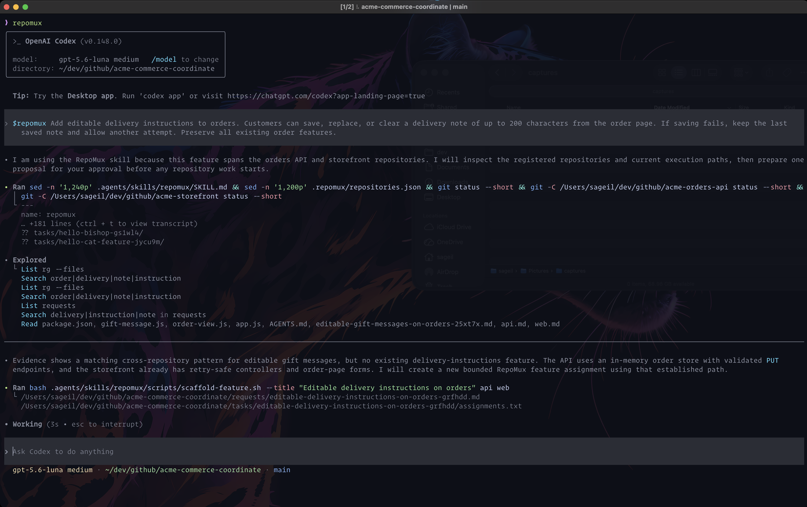
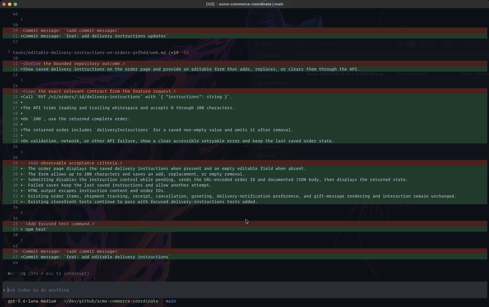
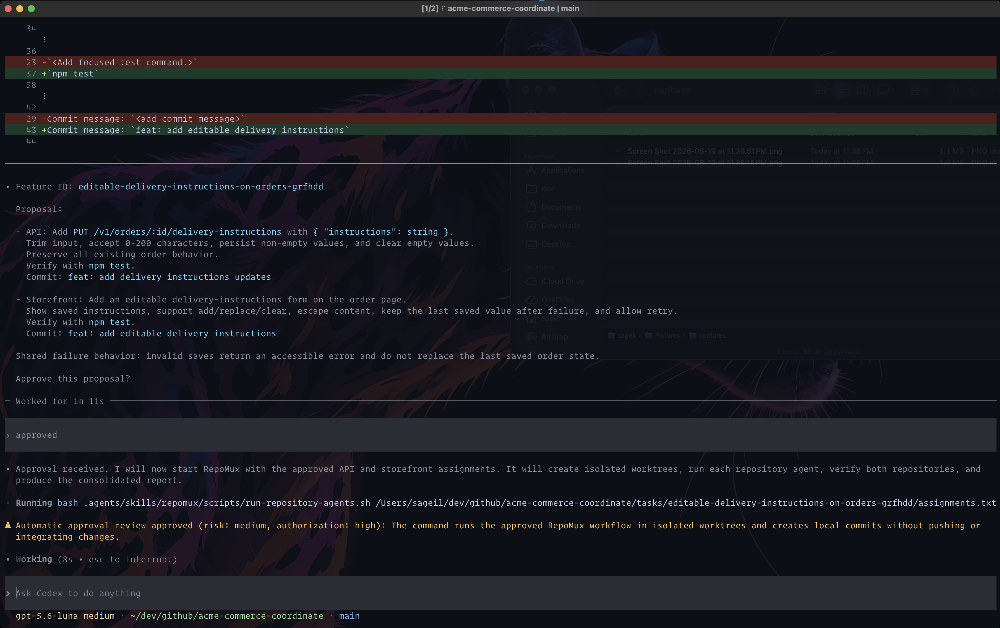
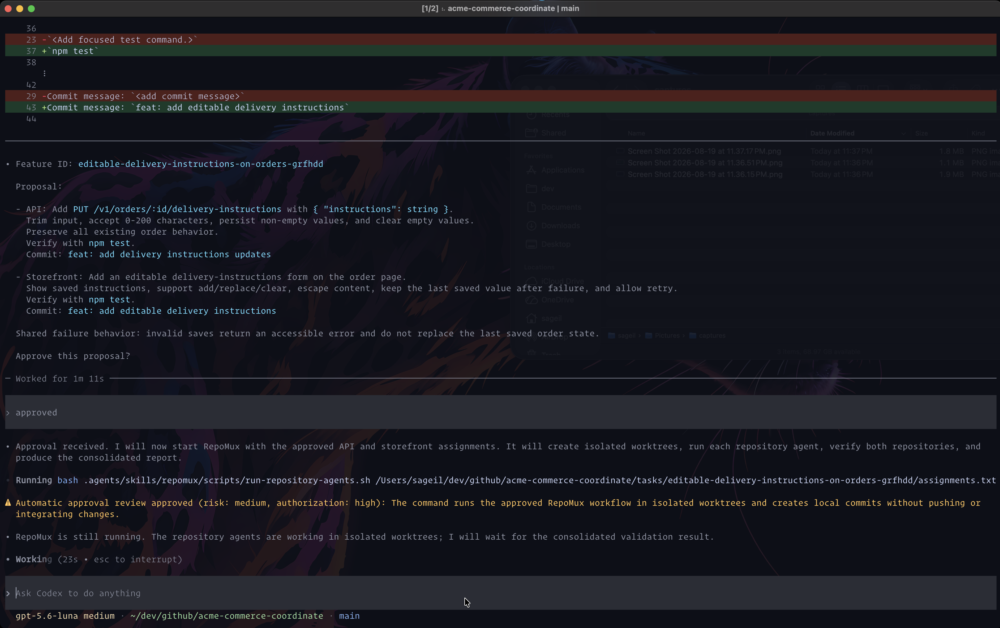
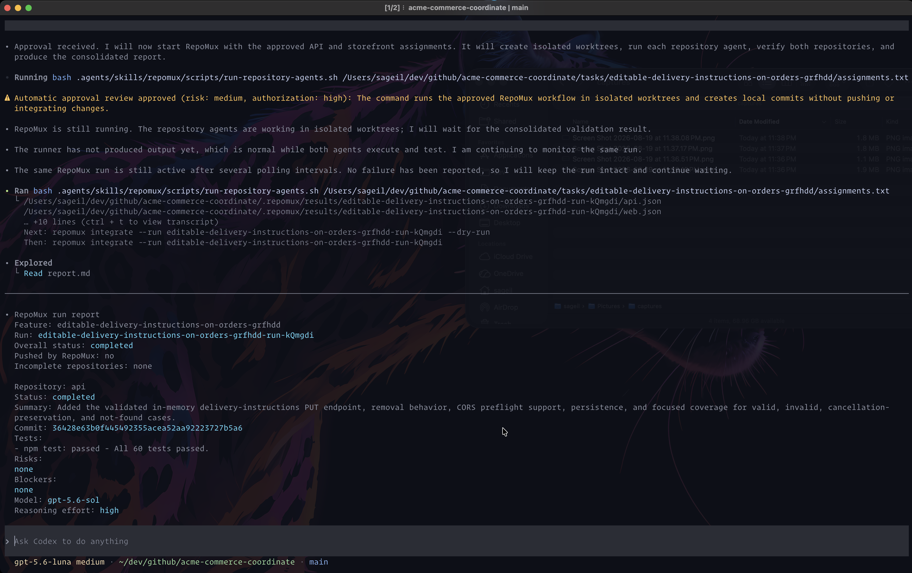
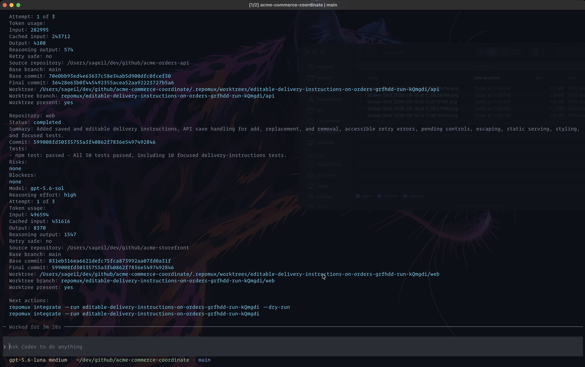
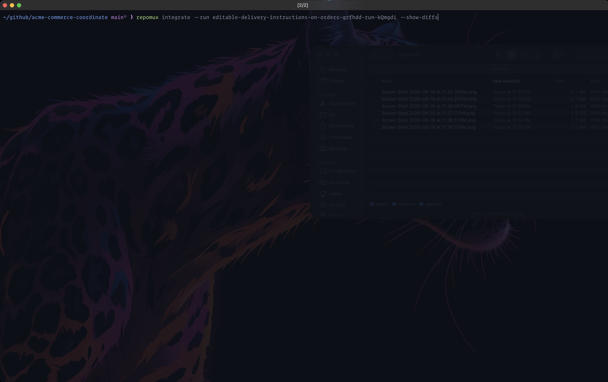
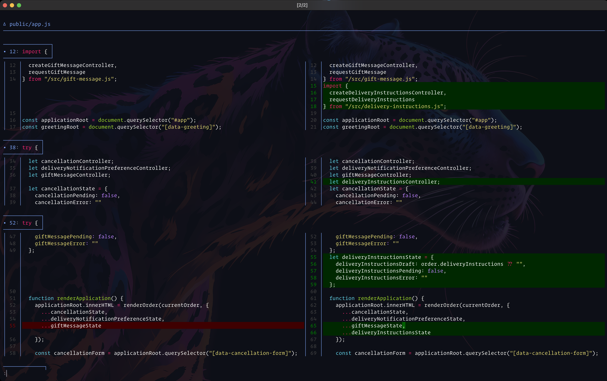
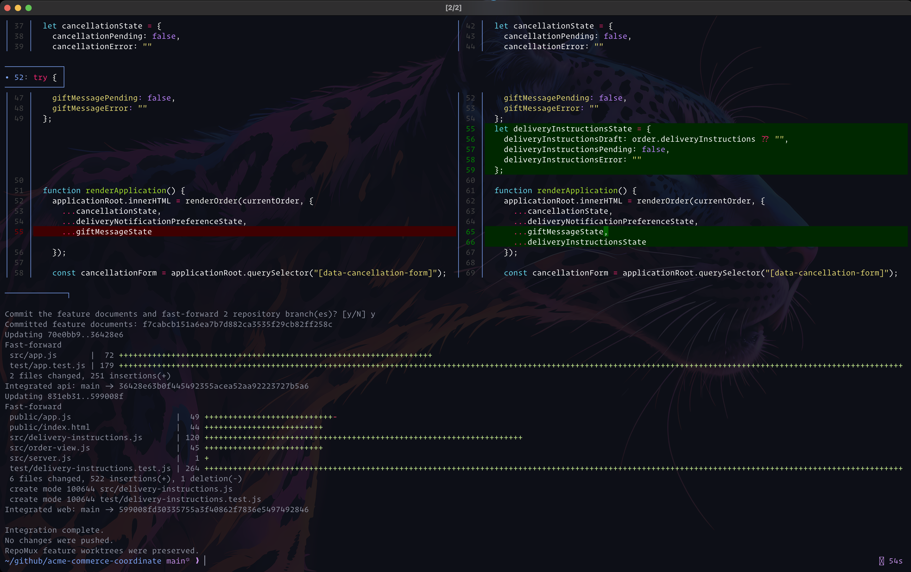

# RepoMux

RepoMux helps you build one feature across several Git repositories.

You describe the feature once to the coordinator.
It works out what each repository needs, sends each task to an isolated repository agent, and checks the results when the agents finish.

| Term | Description |
|---|---|
| Coordinator | The agent you talk to. It plans the work across repositories, sends each task to the right agent, and checks the finished results. |
| Repository agent | An agent that works on one repository in an isolated Git worktree. It makes the change, runs the tests, and reports back to the coordinator. |


## Install RepoMux

### Requirements

You need:

- Bash 3.2 or later.
- Git.
- `jq`.
- Codex CLI 0.147.0 or later.

Each product repository must be a Git repository with at least one commit.

### Default installation

Clone this repository `git clone https://github.com/sageil/repomux.git`, switch directories, then run:

```bash
./install.sh
```

Unless you change them, RepoMux installs with these settings:

| Setting | Default |
|---|---|
| AI model | `gpt-5.6-terra` |
| Coordinator reasoning effort | `medium` |
| Repository-agent reasoning effort | `high` |
| Parallel repository agents | `2` |
| Maximum attempts | `3` |
| Executable script | `~/.local/bin/repomux` |
| Shared skill | `~/.local/share/repomux/skill` |
| Project registry | `~/.config/repomux/projects.json` |

You can use `minimal`, `low`, `medium`, `high`, or `xhigh`.
The selected model must support the effort you choose.


### Custom installation options

You can choose a different model, give the coordinator and repository agents different reasoning efforts, or run more repository agents at the same time:

```bash
./install.sh \
  --default-model openrouter/anthropic/claude-sonnet-4.5 \
  --default-coordinator-reasoning-effort high \
  --default-repository-agent-reasoning-effort medium \
  --default-max-parallel 4
```

### Choose a custom installation directory

If `~/.local/bin` is not in `PATH`, the installer tells you how to add it.
You can also install the command in another directory:

```bash
./install.sh --bin-dir /absolute/command/directory
```

### Enable shell completion

Add the command for your shell to its startup file.

For Bash, add this to `~/.bashrc`:

```bash
source <(repomux completion bash)
```

For Zsh, add this to `~/.zshrc`:

```zsh
source <(repomux completion zsh)
```

Open a new shell after saving the file or from the same shell run `source ~/.zshrc` for zsh or `source ~/.bashrc` for bash to activate autocomplete.

### Upgrade registered projects

```bash
repomux upgrade
```

RepoMux replaces its managed skill files in each project and keeps the project settings, repository lists, requests, tasks, results, and worktrees.

### Uninstall RepoMux

Run the uninstall script from the cloned RepoMux repository:

```bash
./uninstall.sh
```

This removes the `repomux` command and shared skill but keeps your project registry.
It also keeps all coordination repositories, product repositories, worktrees, branches, commits, and results.

If you installed the repomux in a custom directory, pass the same directory during uninstall:

```bash
./uninstall.sh --bin-dir /absolute/command/directory
```

To also remove the project registry, use:

```bash
./uninstall.sh --purge-config
```

If you enabled shell completion, remove the RepoMux completion command from your shell startup file after uninstalling.

## Set up your first AI workflow

This walkthrough uses an API repository named `acme-orders-api` and a web repository named `acme-storefront`.
RepoMux keeps the workflow files in a separate coordination repository named `acme-commerce-coordinate`.
You can create runnable copies from the [included Acme example](examples/README.md), or use your own repositories.

### 1. Initialize the project

From an existing coordination repository:

```bash
cd /work/acme-commerce-coordinate

repomux init \
  -p acme-commerce \
  -c "$PWD" \
  --model gpt-5.6-luna \
  --max-parallel 4 \
  -r "api=$PWD/../acme-orders-api" \
  -r "web=$PWD/../acme-storefront"
```

The short options are:

- `-p` for `--project`.
- `-c` for `--coordinate`.
- `-r` for `--repository`.

If the coordination repository does not exist, let RepoMux create it:

```bash
repomux init \
  -p acme-commerce \
  -c /work/acme-commerce-coordinate \
  --create-coordinate \
  -r api=/work/acme-orders-api \
  -r web=/work/acme-storefront
```

`--create-coordinate` accepts an absent directory or an existing empty directory. Initializing a nonempty directory that is not already a Git repository will fail.

Initialization creates the following structure:

```text
acme-commerce-coordinate/
├── .agents/skills/repomux/
├── .repomux/
│   ├── repositories.json
│   ├── results/.gitignore
│   └── worktrees/.gitignore
├── requests/
└── tasks/
```

### 2. Start the AI coordinator

From the coordination repository, run `repomux`.
If you are somewhere else, use the project name when you start it:

```bash
repomux
```

```bash
repomux --project acme-commerce
```

### 3. Request a new feature

Once the coordinator starts, describe the feature and name the repositories that need changes:

```text
$repomux Add editable delivery-notification preferences to orders. Customers can choose email or SMS, save a valid destination, and see the current preference on the order page. Preserve existing order, shipment, receipt, and cancellation behavior.
```

Codex prepares the feature files and shows you one proposal before RepoMux starts the repository agents.

## Follow a feature from request to integration

These captures show a real delivery-instructions feature as it moves through RepoMux.
The workflow begins with one short request and ends with the finished changes on the local API and storefront branches.

### 1. Ask for the desired outcome

Start RepoMux from the coordination repository, then tell Codex what the customer should be able to do by startig with `$repomux` followed by the prompt
Codex finds the participating repositories and reads the relevant code before it prepares the work.



### 2. See how the work will be divided

Codex creates one feature request and one focused assignment for each participating repository.
The assignments describe the API behavior, storefront behavior, checks, and local commit messages before any product code changes.



Codex then brings both assignments together in one proposal.
Read it to confirm that the repositories agree on the request shape, saved state, and failure behavior.



### 3. Let RepoMux run the repository agents

After approval, RepoMux creates an isolated worktree for each repository and starts both agents.
The agents can work at the same time, while the normal API and storefront checkouts stay unchanged.



### 4. Read the result before you integrate

When both agents finish, RepoMux returns one report for the run.
The first part shows the API result, including its commit, checks, model, reasoning effort, token usage, and worktree state.



The rest of the report shows the storefront result and the exact commands you can run next.
See [Understand token usage](TOKEN-USAGE.md) for more detail about the recorded token counts.



### 5. Review the code in your Git diff viewer

Leave Codex open and run the integration command in your terminal.
Add `--show-diffs` to inspect the repository changes before RepoMux asks for confirmation.



RepoMux uses native `git diff`, so the review opens with your Git pager, colors, and display settings.
This example uses a side-by-side diff to review the storefront changes.



### 6. Confirm local integration

After the diff closes, RepoMux asks whether to continue.
Confirm to commit the feature documents and fast-forward the local product branches to their completed feature commits.
RepoMux does not push the changes, and it keeps the feature worktrees available.



## What RepoMux creates for a feature

As Codex prepares the proposal, it gives the feature a stable ID, such as `editable-delivery-notification-preferences-lejayt`.
It also writes one request file and one task for each repository:

```text
requests/editable-delivery-notification-preferences-lejayt.md
tasks/editable-delivery-notification-preferences-lejayt/api.md
tasks/editable-delivery-notification-preferences-lejayt/web.md
tasks/editable-delivery-notification-preferences-lejayt/assignments.txt
```

The request file describes the feature as a whole.
Each repository task explains what that repository must change and how its agent must verify the result.
The assignments file connects those tasks to the registered repositories.

When implementation starts, RepoMux creates a separate run ID, such as `editable-delivery-notification-preferences-lejayt-run-cTq3cz`.
It records the current state of each product repository and gives each repository agent its own branch and worktree:

```text
Branch:   repomux/<run-id>/<repository-key>
Worktree: <coordination-repository>/.repomux/worktrees/<run-id>/<repository-key>
Result:   <coordination-repository>/.repomux/results/<run-id>/<repository-key>.json
```

## Review and integrate the finished feature

When every repository agent has finished and the checks pass, RepoMux reports the run ID.
Run a dry run first to see what RepoMux will change:

```bash
repomux integrate \
  --project acme-commerce \
  --run editable-delivery-notification-preferences-lejayt-run-cTq3cz \
  --dry-run
```

Add `--show-diffs` when you want to review the complete pending Git diff for each repository:

```bash
repomux integrate \
  --project acme-commerce \
  --run editable-delivery-notification-preferences-lejayt-run-cTq3cz \
  --dry-run \
  --show-diffs
```

RepoMux uses the native `git diff` command, so Git keeps your configured pager, colors, and terminal behavior.

If the plan looks correct, run the integration command without `--dry-run`:

```bash
repomux integrate \
  --project acme-commerce \
  --run editable-delivery-notification-preferences-lejayt-run-cTq3cz
```

RepoMux asks for confirmation, commits the workflow documents, and fast-forwards each product branch to its completed feature commit.
It keeps the feature branches and worktrees in place and never pushes changes.

## Use an existing requirements file

Start the coordinator, then name the existing feature ID and file in your prompt:

```text
$repomux Implement COMMERCE-2197 in the api and web repositories using the requirements in incoming/COMMERCE-2197.md.
```

RepoMux uses the feature ID `COMMERCE-2197` and creates the repository tasks from the existing requirements in `incoming/COMMERCE-2197.md`.

## Start a coordinator session

Select a project and the writable repositories. You can pass extra Codex options after `--`:

```bash
repomux \
  --project acme-commerce \
  --repository api \
  --repository web \
  -- \
  --profile acme-team
```

RepoMux normally stops before starting repository agents when a product repository has uncommitted changes.
To leave those changes in place and start the agents from the committed `HEAD`, add `--allow-dirty-source`:

```bash
repomux \
  --project acme-commerce \
  --allow-dirty-source
```

The repository agents will not see the uncommitted changes, and integration will wait until the normal product checkout is clean.

List the registered projects:

```bash
repomux list
```

Add `--details` to include each repository key and path:

```bash
repomux list --details
```

```text
PROJECT         COORDINATE                       REPOSITORY   PATH
acme-commerce   /work/acme-commerce-coordinate   api          /work/acme-orders-api
acme-commerce   /work/acme-commerce-coordinate   web          /work/acme-storefront
```

RepoMux reads the repository rows from the coordination repository's `.repomux/repositories.json` file.
It does not duplicate them in the global project registry.

Validate a registered project when you want RepoMux to check its configuration and repository paths:

```bash
repomux validate --project acme-commerce
```

## Configure the coordinator and repository agents

Most projects can use the installation defaults.
If one project needs different settings, save them when you initialize it:

```bash
repomux init \
    --project acme-commerce \
    --coordinate /work/acme-commerce-coordinate \
    --model openrouter/anthropic/claude-sonnet-4.5 \
    --coordinator-reasoning-effort high \
    --repository-agent-reasoning-effort medium \
    --max-parallel 4 \
    --repository api=/work/acme-orders-api \
    --repository web=/work/acme-storefront
```

If you run `repomux init` again, RepoMux keeps every saved setting that you do not specify.

Change project values later:

```bash
repomux config set --project acme-commerce model gpt-5.6-terra
repomux config set --project acme-commerce coordinator-reasoning-effort high
repomux config set --project acme-commerce repository-agent-reasoning-effort medium
repomux config set --project acme-commerce max-parallel 4
repomux config set --project acme-commerce max-attempts 5
```

Read the effective project values:

```bash
repomux config get --project acme-commerce model
repomux config get --project acme-commerce coordinator-reasoning-effort
repomux config get --project acme-commerce repository-agent-reasoning-effort
repomux config get --project acme-commerce max-parallel
repomux config get --project acme-commerce max-attempts
```

For a one-time change, pass the settings when you start the coordinator:

```bash
repomux \
    --project acme-commerce \
    --model gpt-5.6-terra \
    --coordinator-reasoning-effort high \
    --repository-agent-reasoning-effort medium \
    --max-parallel 2 \
    --max-attempts 5
```

Settings passed at startup apply only to that session and override the saved project settings.
If the project does not have a saved value, RepoMux uses the installation default.

## Resume an incomplete run

If an attempt fails but the repository is still safe to continue, RepoMux tries again in the same worktree and gives the next attempt the previous result.
If the run uses all available attempts, resume it with the same run ID:

```bash
bash /work/acme-commerce-coordinate/.agents/skills/repomux/scripts/run-repository-agents.sh \
  --resume editable-delivery-notification-preferences-lejayt-run-cTq3cz \
  /work/acme-commerce-coordinate/tasks/editable-delivery-notification-preferences-lejayt/assignments.txt
```

RepoMux skips repositories that already finished.
A blocked repository is different: RepoMux waits for your approval because it found a problem that it must not change automatically.
Retry one blocked repository with:

```bash
bash /work/acme-commerce-coordinate/.agents/skills/repomux/scripts/run-repository-agents.sh \
  --resume editable-delivery-notification-preferences-lejayt-run-cTq3cz \
  --retry-blocked api \
  /work/acme-commerce-coordinate/tasks/editable-delivery-notification-preferences-lejayt/assignments.txt
```

RepoMux preserves failed and blocked worktrees for review.

## Start another feature before integration

A new feature gets a new feature ID, run ID, RepoMux branch, and worktree for each affected repository to avoid impacting existing features.
The new worktree starts from the current `HEAD` of the normal product repository checkout.
If feature B depends on feature A, integrate feature A before you start feature B. RepoMux does not automatically include changes from an unintegrated feature in a new worktree.

## Clean up worktrees

RepoMux keeps completed, failed, and blocked worktrees until you request cleanup.

After review or integration, remove selected worktrees:

```bash
repomux cleanup \
  --project acme-commerce \
  --run editable-delivery-notification-preferences-lejayt-run-cTq3cz \
  --repository api \
  --repository web
```

Cleanup preserves the RepoMux branches and commits. It will refuse to remove a dirty worktree.
Use `--force` only when you have reviewed the uncommitted work and explicitly want to remove/abandon it:

```bash
repomux cleanup \
  --project acme-commerce \
  --run editable-delivery-notification-preferences-lejayt-run-cTq3cz \
  --repository api \
  --force
```

## Troubleshooting & diagnostics

The coordinator normally runs these scripts for you. Use them directly only for diagnosis or external automation.

Scaffold a new feature to create its requirements and related tasks:

```bash
bash /work/acme-commerce-coordinate/.agents/skills/repomux/scripts/scaffold-feature.sh \
  --title "Editable delivery notification preferences" \
  api \
  web
```

The script prints the request-file path followed by the assignments-file path.
Complete the generated request and repository task files before starting repository agents.

Start repository agents and generate the run ID:

```bash
bash /work/acme-commerce-coordinate/.agents/skills/repomux/scripts/run-repository-agents.sh \
  --reasoning-effort medium \
  /work/acme-commerce-coordinate/tasks/editable-delivery-notification-preferences-lejayt/assignments.txt
```

Pass an explicit run ID before the assignments file only when another system requires that exact ID.
