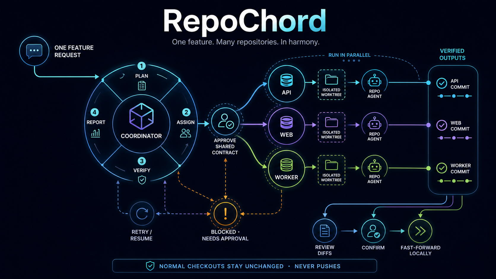
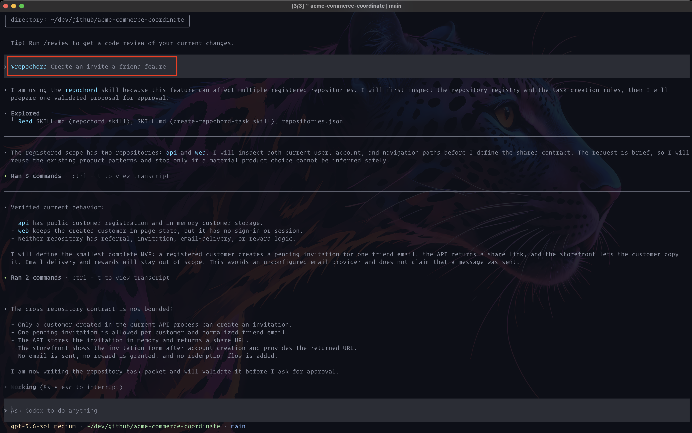
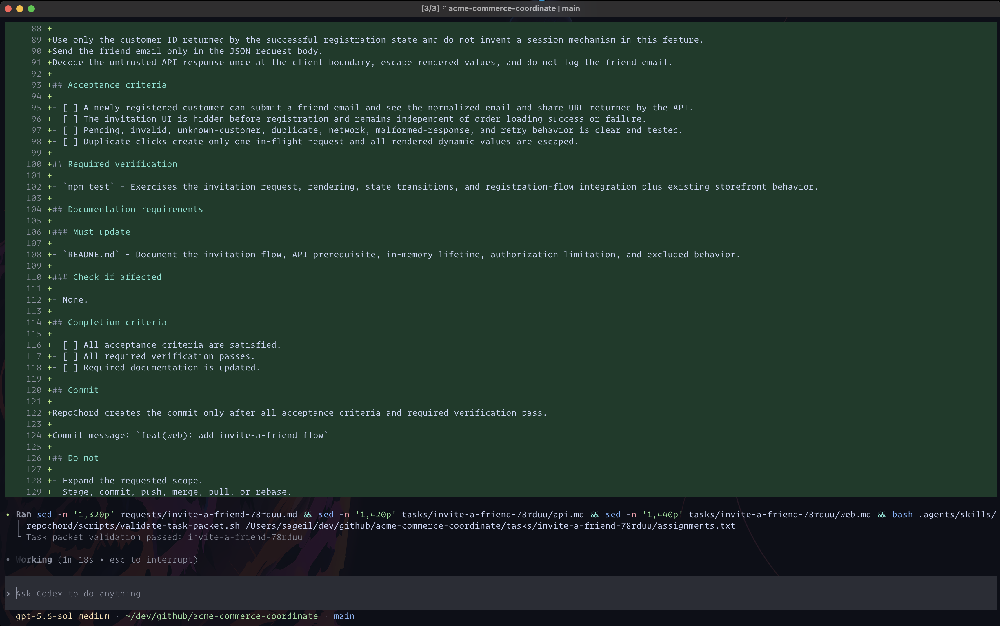
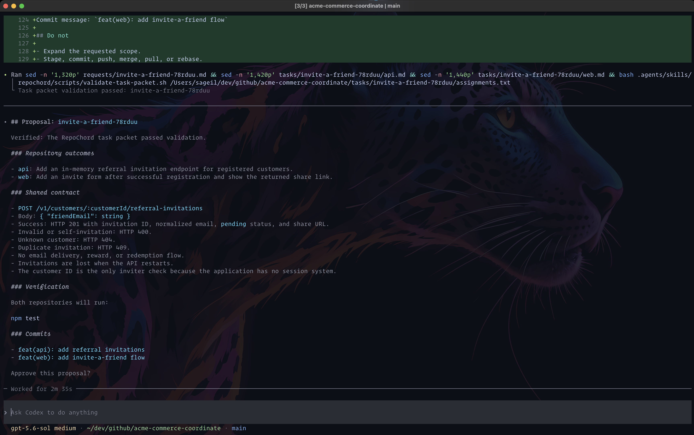
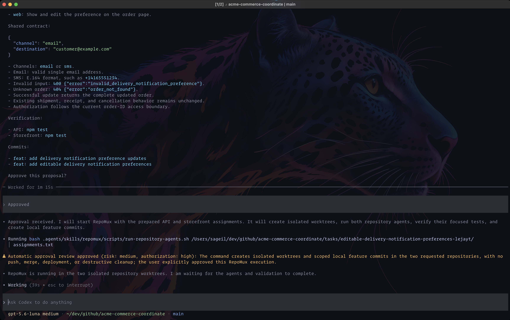
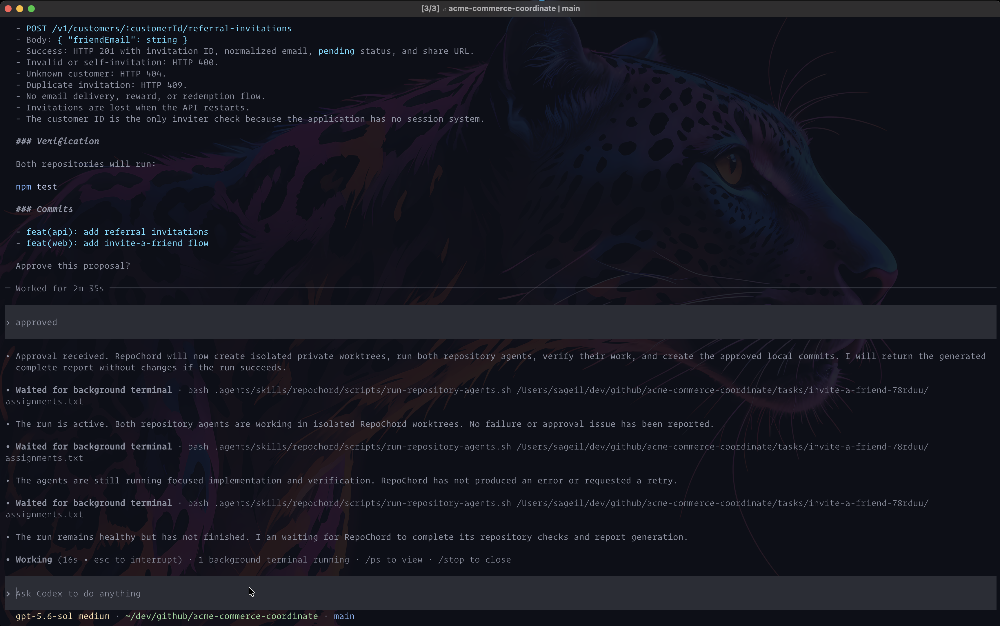
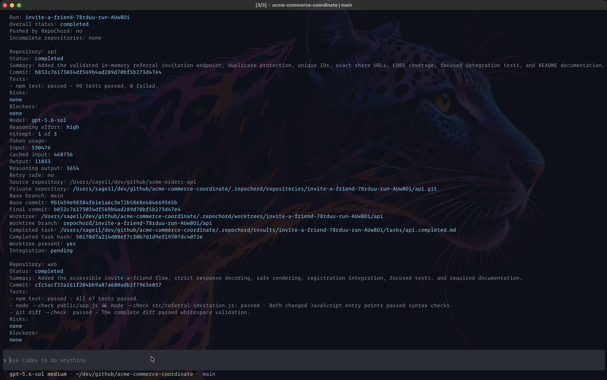
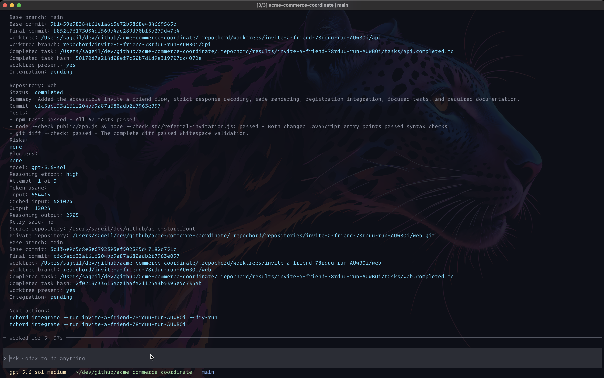
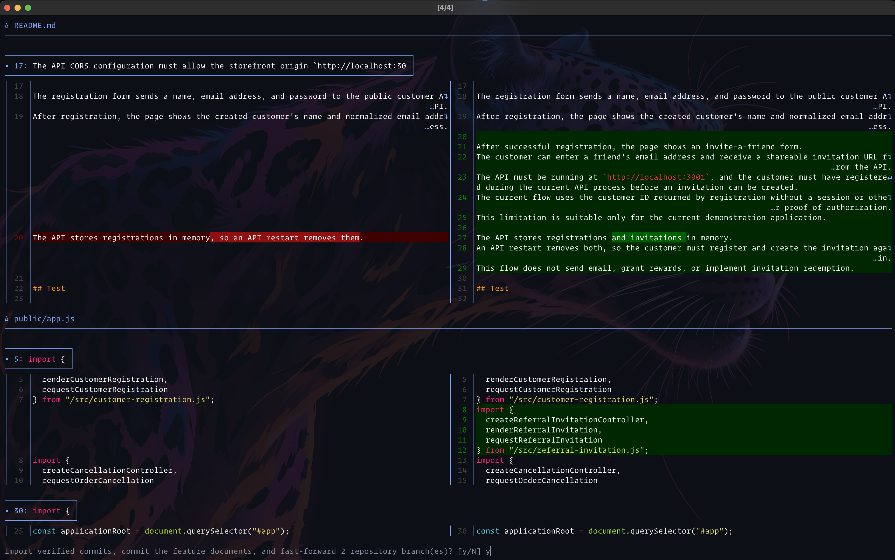
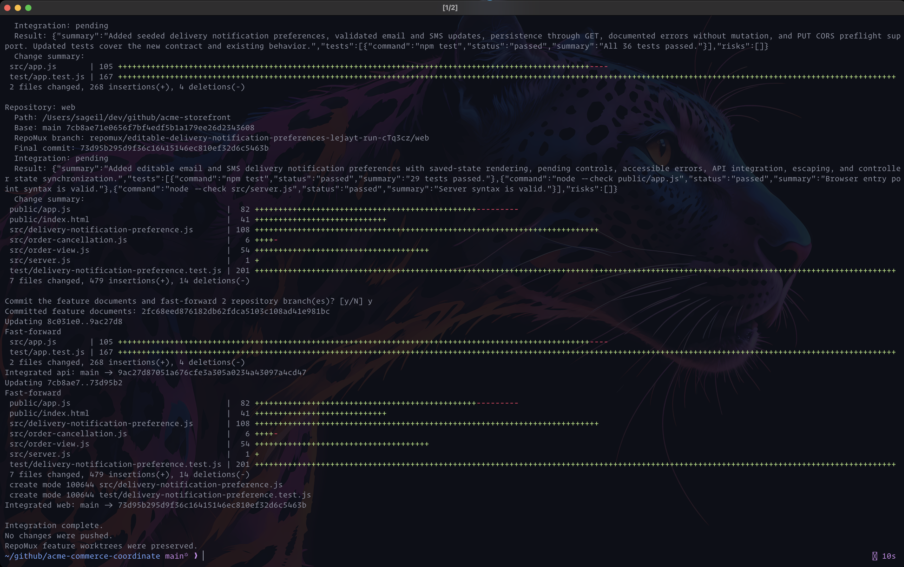

# RepoChord

RepoChord helps you build one feature across several Git repositories.

You describe the feature once to the coordinator.
It works out what each repository needs, sends each task to an isolated repository agent, and checks the results when the agents finish.

| Term | Description |
|---|---|
| Coordinator | The agent you talk to. It plans the work across repositories, sends each task to the right agent, and checks the finished results. |
| Repository agent | An agent that works in an isolated private Git repository and worktree under the coordination repository. It makes the change, runs the tests, and reports back to the coordinator. |




## Install RepoChord

### Requirements

You need:

- Bash 5.2 or later.
- Git.
- `jq`.
- Codex CLI 0.147.0 or later.

Each product repository must be a Git repository with at least one commit.

### Default installation

Clone this repository `git clone https://github.com/sageil/RepoChord.git`, switch directories, then run:

```bash
./install.sh
```

Unless you change them, RepoChord installs with these settings:

| Setting | Default |
|---|---|
| AI model | `gpt-5.6-terra` |
| Coordinator reasoning effort | `medium` |
| Repository-agent reasoning effort | `high` |
| Parallel repository agents | `2` |
| Maximum attempts | `3` |
| Executable script | `~/.local/bin/rchord` |
| Shared coordinator skill | `~/.local/share/repochord/skill` |
| Shared task-authoring skill | `~/.local/share/repochord/task-skill` |
| Project registry | `~/.config/repochord/projects.json` |

Check the installed version with `rchord --version`.

You can use `minimal`, `low`, `medium`, `high`, or `xhigh`.
The selected model must support the effort you choose.


### Custom installation options

You can choose a different model, give the coordinator and repository agents different reasoning efforts, or run more repository agents at the same time:

```bash
./install.sh \
  --default-model openrouter/anthropic/claude-sonnet-4.5 \
  --default-coordinator-reasoning-effort high \
  --default-repository-agent-reasoning-effort medium \
  --default-max-parallel 4
```

### Choose a custom installation directory

If `~/.local/bin` is not in `PATH`, the installer tells you how to add it.
You can also install the command in another directory:

```bash
./install.sh --bin-dir /absolute/command/directory
```

### Enable shell completion

Add the command for your shell to its startup file.

For Bash, add this to `~/.bashrc`:

```bash
source <(rchord completion bash)
```

For Zsh, add this to `~/.zshrc`:

```zsh
source <(rchord completion zsh)
```

Open a new shell to load the completion script.
To enable it now, run `source ~/.bashrc` or `source ~/.zshrc`.

### Upgrade installed cli & projects

Update an installed RepoChord command and shared skills from the current clone:

```bash
./install.sh --upgrade
```

Then update the managed skills in every registered coordination repository:

```bash
rchord upgrade
```

RepoChord replaces its managed skill files in each project and keeps the project settings, repository lists, requests, tasks, results, and worktrees.

### Uninstall RepoChord

Run the uninstall script from the cloned RepoChord repository:

```bash
./uninstall.sh
```

This removes the `rchord` command and both shared skills but keeps your project registry.
It also keeps all coordination repositories, product repositories, worktrees, branches, commits, and results.

If you installed the `rchord` command in a custom directory, pass the same directory when you uninstall it:

```bash
./uninstall.sh --bin-dir /absolute/command/directory
```

To also remove the project registry, use:

```bash
./uninstall.sh --purge-config
```

If you enabled shell completion, remove the RepoChord completion command from your shell startup file after uninstalling.

## Set up your first AI workflow

This walkthrough uses an API repository named `acme-orders-api` and a web repository named `acme-storefront`.
RepoChord keeps the workflow files in a separate coordination repository named `acme-commerce-coordinate`.
You can create runnable copies from the [included Acme example](examples/README.md), or use your own repositories.

### 1. Initialize the project

From an existing coordination repository:

```bash
cd /work/acme-commerce-coordinate

rchord init \
  -p acme-commerce \
  -c "$PWD" \
  --model gpt-5.6-luna \
  --max-parallel 4 \
  -r "api=$PWD/../acme-orders-api" \
  -r "web=$PWD/../acme-storefront"
```

The short options are:

- `-p` for `--project`.
- `-c` for `--coordinate`.
- `-r` for `--repository`.

If the coordination repository does not exist, let RepoChord create it:

```bash
rchord init \
  -p acme-commerce \
  -c /work/acme-commerce-coordinate \
  --create-coordinate \
  -r api=/work/acme-orders-api \
  -r web=/work/acme-storefront
```

`--create-coordinate` accepts an absent directory or an existing empty directory. Initializing a nonempty directory that is not already a Git repository will fail.

Initialization creates the following structure:

```text
acme-commerce-coordinate/
├── .agents/skills/
│   ├── create-repochord-task/
│   └── repochord/
├── .repochord/
│   ├── repositories.json
│   ├── repositories/.gitignore
│   ├── results/.gitignore
│   └── worktrees/.gitignore
├── requests/
└── tasks/
```

### 2. Start the AI coordinator

From the coordination repository, run `rchord`.
If you are somewhere else, use the project name when you start it:

```bash
rchord
```

```bash
rchord --project acme-commerce
```

## Follow a feature from request to integration

These captures follow a real invite-a-friend feature from one short request to finished changes on the local API and storefront branches.
The example adds an in-memory referral invitation API and a storefront form that shows a share link after registration.

### 1. Ask for the desired outcome

Begin your prompt with `$repochord`, then describe the result you want:

```text
$repochord Create an invite-a-friend feature.
```

RepoChord finds the registered API and storefront repositories, then Codex reads the current registration flow in both repositories.
Here, Codex also makes the limits clear: the first version creates a shareable invitation, but it does not send email, grant rewards, or add a redemption flow.



### 2. Review the proposed work

Codex creates one feature request and one focused assignment for each repository.
The tasks spell out the shared API contract, error cases, tests, documentation, and commit messages before any product code changes.

RepoChord validates the complete task packet before it asks for approval.



The proposal gives you one place to check how the repositories will work together.
In this example, it shows the endpoint, request body, success result, expected errors, known limits, verification command, and planned commits.



### 3. Let RepoChord run the repository agents

Type `approved` when the proposal matches the outcome you want.
RepoChord then creates an isolated private repository and worktree for each assignment and starts both agents.



The API and storefront agents can work at the same time while your normal checkouts stay unchanged.
Codex keeps the session open and reports whether the run is still healthy while the agents implement and test their changes.



### 4. Read the result before you integrate

When both agents finish, RepoChord returns one report for the complete run.
The first part shows the overall status and the API result, including its summary, commit, checks, token usage, and worktree state.



The rest of the report shows the storefront result and the exact integration commands you can run next.
Check that each repository is complete and has no blockers before you continue.
See [Understand token usage](TOKEN-USAGE.md) for more detail about the recorded token counts.



### 5. Review the code in your Git diff viewer

Leave Codex open and run the integration command in your terminal.
Add `--show-diffs` to inspect every pending repository change before RepoChord asks for confirmation:

```bash
rchord integrate --run invite-a-friend-78rduu-run-AUwB0i --show-diffs
```


RepoChord uses native `git diff`, so the review opens with your Git pager, colors, and display settings.
This example uses a side-by-side view to inspect the storefront documentation and code.
When the diff closes, RepoChord asks whether to import the verified commits and fast-forward both repository branches.



### 6. Check the completed integration

After you confirm, RepoChord commits the feature documents, imports the verified commits, and fast-forwards the local API and storefront branches.
The final message confirms which branches changed.
RepoChord does not push the changes, and it keeps the feature worktrees for later review or cleanup.



## What RepoChord creates for a feature

As Codex prepares the proposal, it gives the feature a stable ID, such as `invite-a-friend-78rduu`.
It also writes one request file and one task for each repository:

```text
requests/invite-a-friend-78rduu.md
tasks/invite-a-friend-78rduu/api.md
tasks/invite-a-friend-78rduu/web.md
tasks/invite-a-friend-78rduu/assignments.txt
```

The request file describes the feature as a whole.
Each repository task explains what that repository must change and how its agent must verify the result.
The assignments file connects those tasks to the registered repositories.

When implementation starts, RepoChord creates a separate run ID, such as `invite-a-friend-78rduu-run-AUwB0i`.
It records the current state of each product repository and gives each repository agent its own private repository, branch, and worktree:

```text
Repository: <coordination-repository>/.repochord/repositories/<run-id>/<repository-key>.git
Branch:     repochord/<run-id>/<repository-key>
Worktree:   <coordination-repository>/.repochord/worktrees/<run-id>/<repository-key>
Result:     <coordination-repository>/.repochord/results/<run-id>/<repository-key>.json
```

## Review and integrate the finished feature

When every repository agent has finished and the checks pass, RepoChord reports the run ID.
Run a dry run first to see what RepoChord will change:

```bash
rchord integrate \
  --project acme-commerce \
  --run invite-a-friend-78rduu-run-AUwB0i \
  --dry-run
```

Add `--show-diffs` when you want to review the complete pending Git diff for each repository:

```bash
rchord integrate \
  --project acme-commerce \
  --run invite-a-friend-78rduu-run-AUwB0i \
  --dry-run \
  --show-diffs
```

RepoChord uses the native `git diff` command, so Git keeps your configured pager, colors, and terminal behavior.

If the plan looks correct, run the integration command without `--dry-run`:

```bash
rchord integrate \
  --project acme-commerce \
  --run invite-a-friend-78rduu-run-AUwB0i
```

RepoChord asks for confirmation before it writes to the product repositories.
After confirmation, it imports each verified private commit without creating a product feature branch, commits the workflow documents, and fast-forwards each product base branch.
It keeps the private repositories, feature branches, and worktrees in place and never pushes changes.

## Use an existing requirements file

Start the coordinator, then name the existing feature ID and file in your prompt:

```text
$repochord Implement COMMERCE-2197 in the api and web repositories using the requirements in incoming/COMMERCE-2197.md.
```

RepoChord uses the feature ID `COMMERCE-2197` and creates the repository tasks from the existing requirements in `incoming/COMMERCE-2197.md`.

## Start a coordinator session

Select a project and the writable repositories. You can pass extra Codex options after `--`:

```bash
rchord \
  --project acme-commerce \
  --repository api \
  --repository web \
  -- \
  --profile acme-team
```

RepoChord normally stops before starting repository agents when a product repository has uncommitted changes.
To leave those changes in place and start the agents from the committed `HEAD`, add `--allow-dirty-source`:

```bash
rchord \
  --project acme-commerce \
  --allow-dirty-source
```

The repository agents will not see the uncommitted changes, and integration will wait until the normal product checkout is clean.

List the registered projects:

```bash
rchord list
```

Add `--details` to include each repository key and path:

```bash
rchord list --details
```

```text
PROJECT         COORDINATE                       REPOSITORY   PATH
acme-commerce   /work/acme-commerce-coordinate   api          /work/acme-orders-api
acme-commerce   /work/acme-commerce-coordinate   web          /work/acme-storefront
```

RepoChord reads the repository rows from the coordination repository's `.repochord/repositories.json` file.
It does not duplicate them in the global project registry.

Validate a registered project when you want RepoChord to check its configuration and repository paths:

```bash
rchord validate --project acme-commerce
```

## Configure the coordinator and repository agents

Most projects can use the installation defaults.
If one project needs different settings, save them when you initialize it:

```bash
rchord init \
    --project acme-commerce \
    --coordinate /work/acme-commerce-coordinate \
    --model openrouter/anthropic/claude-sonnet-4.5 \
    --coordinator-reasoning-effort high \
    --repository-agent-reasoning-effort medium \
    --max-parallel 4 \
    --repository api=/work/acme-orders-api \
    --repository web=/work/acme-storefront
```

If you run `rchord init` again, RepoChord keeps every saved setting that you do not specify.

Change project values later:

```bash
rchord config set --project acme-commerce model gpt-5.6-terra
rchord config set --project acme-commerce coordinator-reasoning-effort high
rchord config set --project acme-commerce repository-agent-reasoning-effort medium
rchord config set --project acme-commerce max-parallel 4
rchord config set --project acme-commerce max-attempts 5
```

Read the effective project values:

```bash
rchord config get --project acme-commerce model
rchord config get --project acme-commerce coordinator-reasoning-effort
rchord config get --project acme-commerce repository-agent-reasoning-effort
rchord config get --project acme-commerce max-parallel
rchord config get --project acme-commerce max-attempts
```

For a one-time change, pass the settings when you start the coordinator:

```bash
rchord \
    --project acme-commerce \
    --model gpt-5.6-terra \
    --coordinator-reasoning-effort high \
    --repository-agent-reasoning-effort medium \
    --max-parallel 2 \
    --max-attempts 5
```

Settings passed at startup apply only to that session and override the saved project settings.
If the project does not have a saved value, RepoChord uses the installation default.

## Resume an incomplete run

If an attempt fails but can safely continue, RepoChord starts the next attempt in the same worktree and includes the previous result.
After the run uses all configured attempts, increase the limit and resume the same run:

```bash
rchord resume \
  --project acme-commerce \
  --run invite-a-friend-78rduu-run-AUwB0i \
  --max-attempts 5
```

RepoChord skips repositories that already finished.
A blocked repository is different: RepoChord waits for your approval because it found a problem that it must not change automatically.
Retry one blocked repository with:

```bash
rchord resume \
  --project acme-commerce \
  --run invite-a-friend-78rduu-run-AUwB0i \
  --retry-blocked api
```

RepoChord reads the original assignments path from the run manifest and validates the unchanged request, assignments, and repository task files before it resumes work.

RepoChord preserves failed and blocked worktrees for review.

## Start another feature before integration

A new feature gets a new feature ID, run ID, private repository, RepoChord branch, and worktree for each affected repository to avoid impacting existing features.
The new worktree starts from the current `HEAD` of the normal product repository checkout.
If feature B depends on feature A, integrate feature A before you start feature B. RepoChord does not automatically include changes from an unintegrated feature in a new worktree.

## Clean up worktrees

RepoChord keeps completed, failed, and blocked worktrees until you request cleanup.
Cleanup removes only the selected Git worktree checkouts.
It does not delete private repositories, RepoChord branches, commits, run results, reports, requests, assignments, or repository task files.
The preserved data lets RepoChord integrate completed work, generate reports, and restore a clean worktree during resume.

After review or integration, remove worktree checkouts that you no longer need open:

```bash
rchord cleanup \
  --project acme-commerce \
  --run invite-a-friend-78rduu-run-AUwB0i \
  --repository api \
  --repository web
```

Cleanup will refuse to remove a dirty worktree.
Use `--force` only when you have reviewed the uncommitted work and explicitly want to remove/abandon it:

```bash
rchord cleanup \
  --project acme-commerce \
  --run invite-a-friend-78rduu-run-AUwB0i \
  --repository api \
  --force
```

Remove one repository's worktrees from every run in a project:

```bash
rchord cleanup \
  --project acme-commerce \
  --repository api \
  --all \
  --force
```

Remove all repository worktrees from every run in a project:

```bash
rchord cleanup \
  --project acme-commerce \
  --all \
  --force
```

## Troubleshooting and diagnostics

Use the [troubleshooting and diagnostics guide](docs/troubleshooting.md) for direct task-packet and repository-agent commands.

## Development

Use the [development and releases guide](docs/development.md) for generated files, verification, versioning, and manual releases.

## License

RepoChord is available under the [MIT License](LICENSE).
